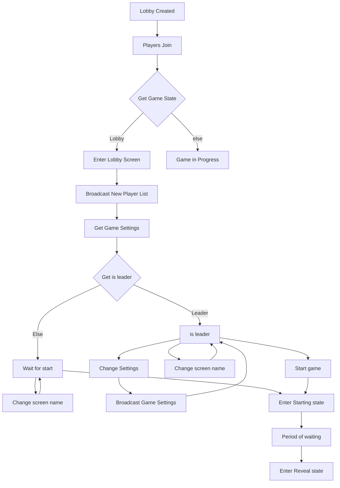

# Design

```mermaid

flowchart TD

lc[Lobby Created] --> pj
pj[Players Join] --> gsj
gsj -->|Lobby| el[Enter Lobby Screen]
gsj -->|else| gip[Game in Progress]
el --> bpl
bpl --> ggs
ggs --> gil
gil --> |Leader| il 
gil --> |Else| wls

cn1 --> wls
wls --> cn1

il --> cs
cs --> bgs
bgs --> il
il --> cn2
cn2 --> il
il --> sg

wls --> ess
sg --> ess
pow --> ers
ess --> pow


bpl[Broadcast New Player List]
bgs[Broadcast Game Settings]
ggs[Get Game Settings]
gsj{Get Game State}
gil{Get is leader}
il[is leader]
wls[Wait for start]
cn1[Change screen name]
cn2[Change screen name]
cs[Change Settings]
sg[Start game]
ess[Enter Starting state]
pow[Period of waiting]
ers[Enter Reveal state]


```